### 3.1: LUIS Design Principles

This session focuses on the design aspects of LUIS with an emphasis on schema design that has been established by conducting engagements with partners and customers. At the end of this session you will be able to:
 
1. Design Domains and Intents
2. Designing Entities
3. Managing Utterances
4. Best Practices

### Section 1: Design Domains and Intents

In this section, you will explore the steps required to design LUIS Domains and Intents, including:

1. Understanding LUIS Domain Options
2. Determining Intents
3. Bot Logic Flow – Intents
4. LUIS Intent Evolution/Roadmap

### Section 1.1: Understanding LUIS Domain Options.

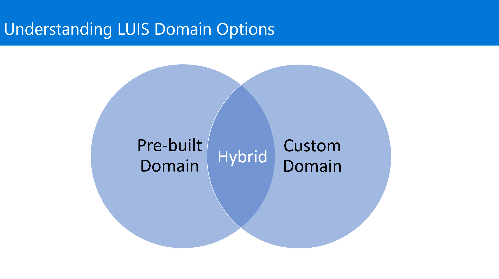

A LUIS app is usually centered around a domain-specific topic. For example, you may have a travel app that performs booking of tickets, flights, hotels, and rental cars. Another app may provide content related to exercising, tracking fitness efforts and setting goals. 

Language Understanding (LUIS) provides prebuilt domains, which are prebuilt sets of intents and entities that work together for domains or common categories of client applications. The prebuilt domains have been pre-trained and are ready for you to add to your LUIS app. You can find a full listing of the prebuilt domains in the Prebuilt domains reference. The intents and entities in a prebuilt domain are fully customizable once you've added them to your app - you can train them with utterances from your system so they work for your users. You can use an entire prebuilt domain as a starting point for customization, or just borrow a few intents or entities from a prebuilt domain. 

The intents and entities in a prebuilt domain work best together. It's better to combine intents and entities from the same domain when possible. A best practice is to use related intents from the same domain. For example, if you are customizing the MakeReservation intent in the Places domain, then select the Cancel intent from the Places domain instead of the Cancel intent in the Events or Utilities domains.

* Tip
Check out the Utilities domain for prebuilt intents that you can customize for use in any domain. For example, you can add Utilities.Repeat to your app and train it recognize whatever actions user might want to repeat in your application.

Alternatively, you can create your own domain with their own set of intents and entities.

### Section 1.2: Determining Intents.

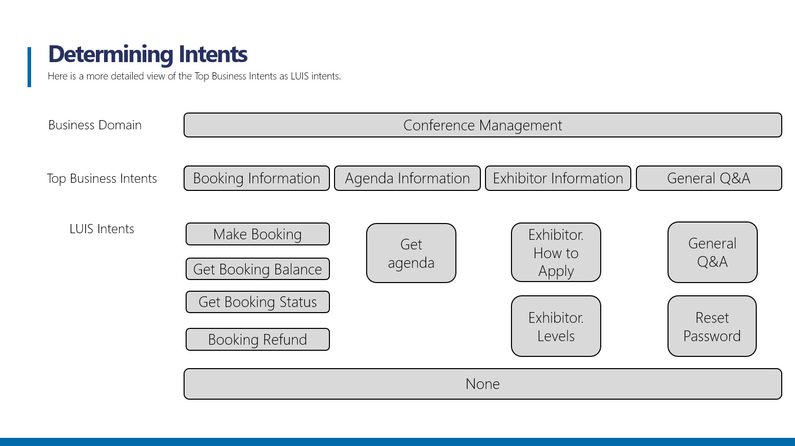

Think about the intents that are important to your application’s task. Let's take the example of a conference app, with functions to take bookings and check the agenda at the user's conference. You can define the "BookConference" and "GetAgenda" intents for these actions. In a more complex app with more functions, you will have more intents, and you should define them carefully so as to not be too specific. For example, “GetBookingBalance" and “GetBookStatus" may need to be separate intents, but “GetBookingBalance" and “GetBookStatus" may be too similar.

Using the None Intent.

The None intent is fallback for app. The None intent is a catch-all or fallback intent. It is used to teach LUIS utterances that are not important in the app domain (subject area). 
None intent helps conversation direction. When an utterance is predicted as the None intent and returned to the bot with that prediction, the bot can ask more questions or provide a menu to direct the user to valid choices in the bot. 
No utterances in None intent skews predictions. If you do not add any utterances for the None intent, LUIS forces an utterance that is outside the domain into one of the domain intents. This will skew the prediction scores by teaching LUIS the wrong intent for the utterance. 

* NOTE
It is a best practice to use only as many intents as you need to perform the functions of your app. If you define too many intents, it becomes harder for LUIS to classify utterances correctly. If you define too few, they may be so general as to be overlapping.

### Section 1.3: Bot Logic Flow - Intents.

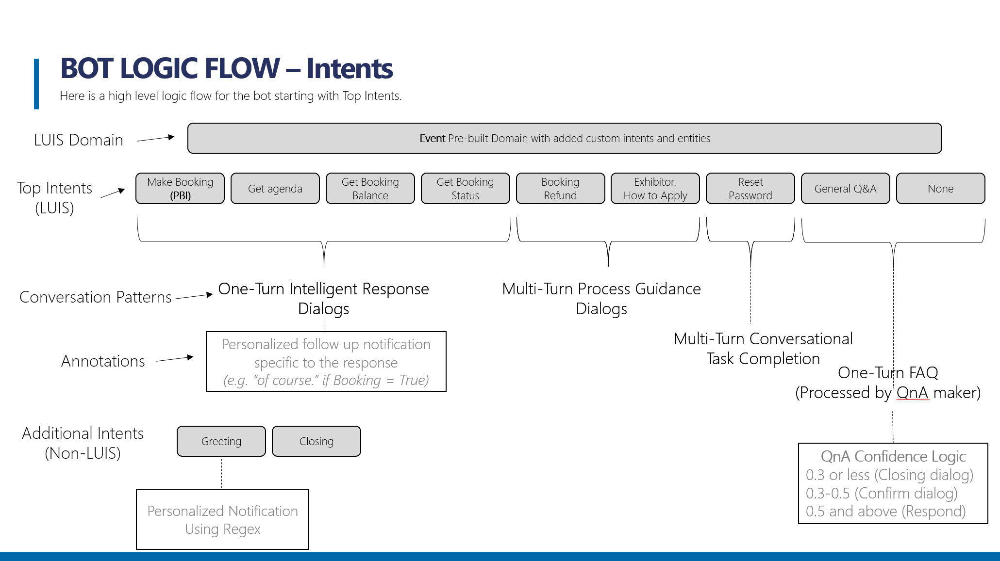

The slide shows an example of how you can map the use case intents to a conversation flow in more detail. The starting point for the this diagram is from the Bot Logic Flow – High Level design. The intention here is to focus on the conversational flow and you can start to add the supporting technology. In addition you can annotate the diagram to outline any logic for determining responses and personalization. The Logic Flow does not have to use this format, but it is important to ensure that the format is understood by the intended audience.

### Section 1.4: LUIS Intent Evolution/Roadmap.

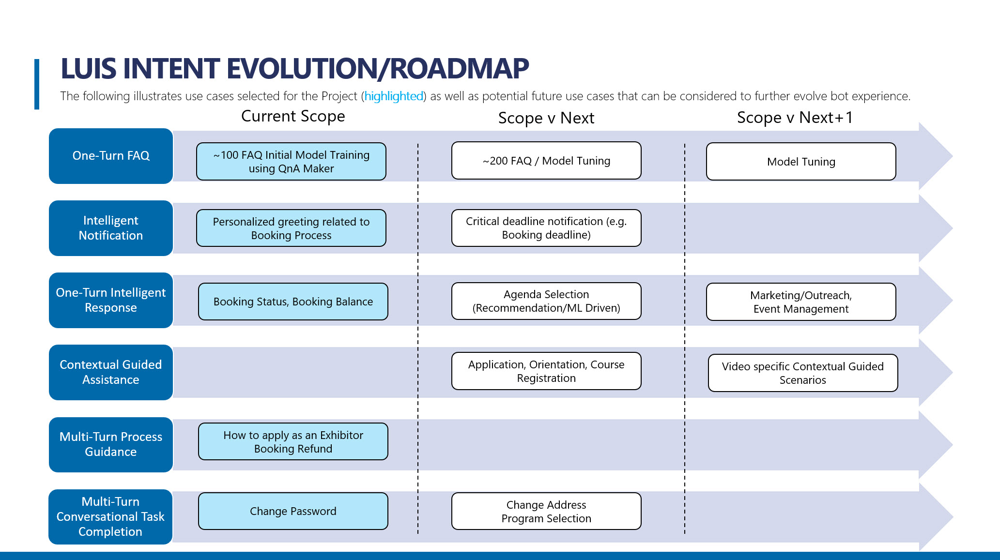

With a more detailed discovery of the business intents, you can augment the high level bot roadmap with greater detail to include the LUIS intents. 

### Section 1.5: Discussion. One intent, or multiple intents. That is the question.

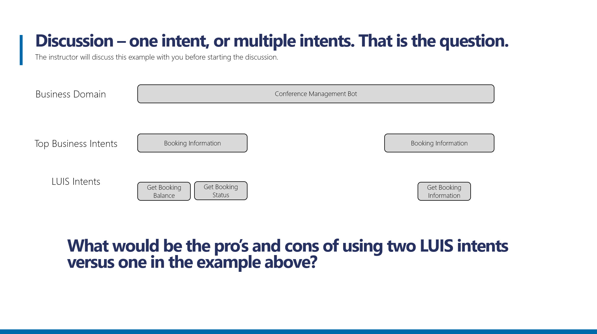

What would be the pro’s and cons of using two LUIS intents versus one in the example on the slide?

There is no right or wrong answer here.

The key points to pick up from the discussion is that students understand that:

An intent represents the actions that the user wants to perform.

So the question that needs to be answered in the context of the discussion example is whether or not “Get Booking Balance” and “Get Booking Status” are two separate actions or could they be merged as a single action “Get Booking Information”, and secondly what is the pro and con of each approach.

Encourage the students to discuss both options and come to a conclusion.

### Section 2: Designing Entities

In this section, you will explore the steps required to design entities, including:

1. Understanding Entities
2. Entity types

### Section 2.1: Understanding Entities.

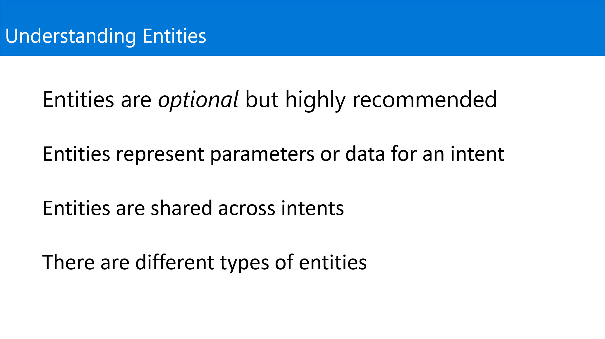

* Entities are optional but highly recommended.

While intents are required, entities are optional. You do not need to create entities for every concept in your app, but only for those required for the app to take action. If your utterances do not have details your bot needs to continue, you do not need to add them. As your app matures, you can add them later. If you are not sure how you would use the information, add a few common prebuilt entities such as datetimeV2, ordinal, email, and phone number.

* Entities represent data

Entities are data you want to pull from the utterance. This can be a name, date, product name, or any group of words. For example in the utterance “Buy a ticket from New York to London on March 5”, three entities are used. Location.Origin, Location.Destination and Prebuilt datetimeV2 which would contain the value “New York”, “London” and “March 5” respectively.

* Entities are shared across intents

Entities are shared among intents. They don't belong to any single intent. Intents and entities can be semantically associated but it is not an exclusive relationship.
In the utterance "Book me a ticket to Paris", "Paris" is an entity of type location. By recognizing the entities that are mentioned in the user’s input, LUIS helps you choose the specific actions to take to fulfill an intent.

* Types of entities

LUIS offers many types of entities as shown in the next slide

### Section 2.2: Understanding Entity Types.

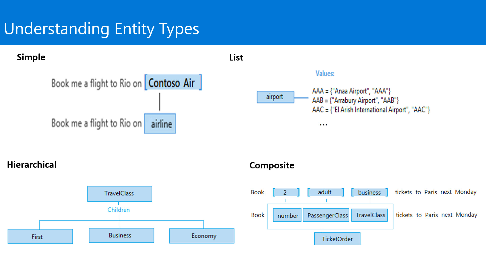

Entities are important for accomplishing an intent. When you determine which entities to use in your app, keep in mind that there are different types of entities for capturing relationships between types of objects. The following entities exist:

* Simple entity
A simple entity describes a single concept.

* Hierarchical entity
A hierarchical entity represents a category and its members. 

* Composite entity
A composite entity is made up of other entities that form parts of a whole. 

* List entity
A list entity is an explicitly specified list of values. Each value consists of one or more synonyms. In a travel app, you might choose to create a list entity to represent airport names.

* Prebuilt entity
LUIS provides prebuilt entities for common types like Number, which you can use for the number of tickets in a ticket order.

* Other entities

Machine-learned entities work best when tested via endpoint queries and reviewing endpoint utterances. 
Regular expression entities use the open-source Recognizers-Text project. There are many examples of the regular expressions in the /Specs directory for the supported cultures. If your specific culture or regular expression isn't currently supported, contribute to the project. 
Exact-match entities use the text provided in the entity to make an exact text match.

Always think of the users perceive access for completing a task with your application or bot. Choosing a correct entity type could help your applications fulfil a user request more quickly and fulfill their needs. 

### Section 2.3: Discussion - Entities.

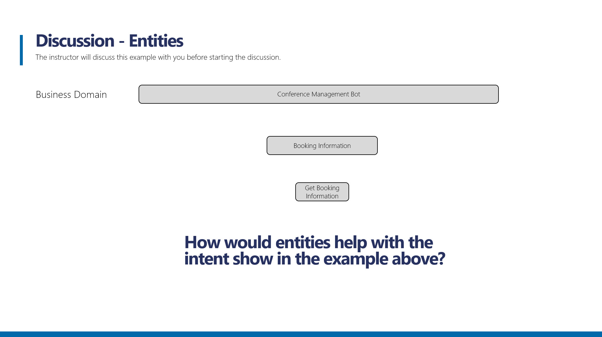

How would entities help with the above example?

There is no right or wrong answer here.

The key points to pick up from the discussion is that students understand that:

Entities represent the data or parameter aspects of the utterance that will feed the intent.
Entities are optional. 

Direct the students to define useful entities that surround booking information and booking status

What other entities could be used in the area?  Booking fees, Booking prices etc.

### Section 3: Managing Utterances

In this section, you will explore the practices for managing utterances, including:

1. Utterance Design Guidance
2. Utterance Review Guidance

### Section 3.1: Utterance Design Guidance.

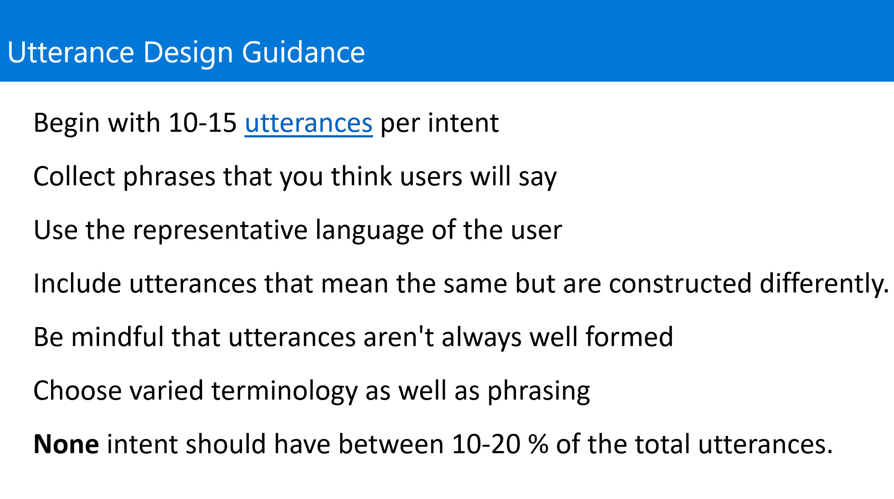

Utterances are input from the user that your app needs to interpret. To train LUIS to extract intents and entities from them, it's important to capture a variety of different inputs for each intent. Active learning, or the process of continuing to train on new utterances, is essential to machine-learned intelligence that LUIS provides.

Collect phrases that you think users will say, and include utterances that mean the same thing but are constructed differently. 

* How to choose varied utterances
When you first get started by adding example utterances to your LUIS model, here are some principles to keep in mind.
Utterances aren't always well formed. It may be a sentence, like "Book me a ticket to Paris", or a fragment of a sentence, like "Booking" or "Paris flight." Users often make spelling mistakes. When planning your app, consider whether or not you spell-check user input before passing it to LUIS. The Bing Spell Check API integrates with LUIS. You can associate your LUIS app with an external key for the Bing Spell Check API when you publish it. If you do not spell check user utterances, you should train LUIS on utterances that include typos and misspellings.

* Use the representative language of the user
When choosing utterances, be aware that what you think is a common term or phrase might not be to the typical user of your client application. They may not have domain experience. So be careful when using terms or phrases that a user would only say if they were an expert.

* Choose varied terminology as well as phrasing
You will find that even if you make efforts to create varied sentence patterns, you will still repeat some vocabulary.
Take the following example utterances:

how do I get a computer? 
Where do I get a computer? 
I want to get a computer, how do I go about it? 
When can I have a computer? 

The core term here, "computer", is not varied. They could say desktop computer, laptop, workstation, or even just machine. LUIS intelligently infers synonyms from context, but when you create utterances for training, it's still better to vary them.

* Example utterances in each intent
Each intent needs to have example utterances. If you have an intent but do not have any example utterances in that intent, you will not be able to train LUIS. If you have an intent with one or very few example utterances, LUIS will not be able to give accurate predictions. 

* Training utterances
Training is non-deterministic: the utterance prediction could vary slightly across versions or apps.

### Section 3.2: Utterance Review Guidance.

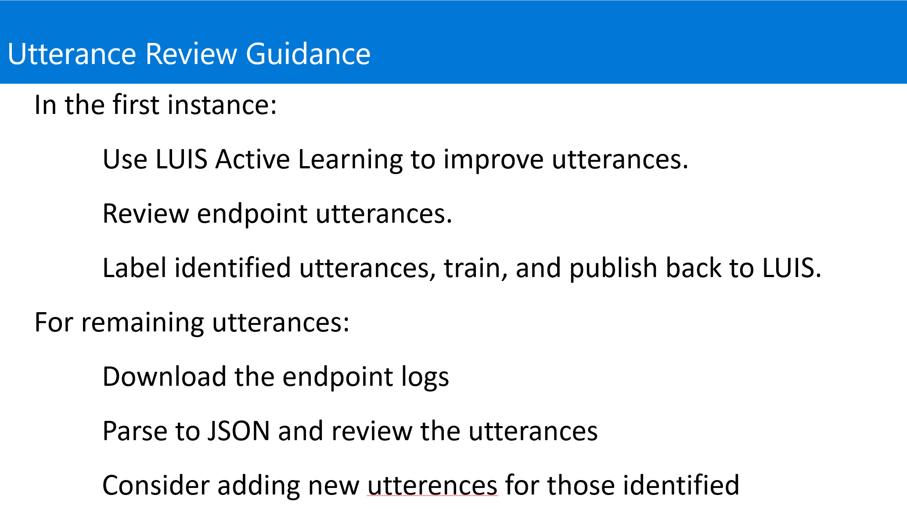

* Review utterances
After your model is trained, published, and receiving endpoint queries, review the utterances suggested by LUIS. LUIS selects endpoint utterances that have low scores for either the intent or entity. 

### Section 3.3: Discussion. Defining Utterances

Define a set of utterances for each of the intents in the example?

There is no right or wrong answer here.

The key points to pick up from the discussion is that students understand that:

Utterances are input from the user that your app needs to interpret.
Utterances aren’t always well formed
Use the language that represents the users
Choose varied terminology as well as phrasing

Answers will vary, but should consider the issue described above

### Section 4: Best Practices

In this section, you will explore a summary of the following:

1. Best Practices
2. Enterprise Considerations

### Section 4.1: Best Practices.

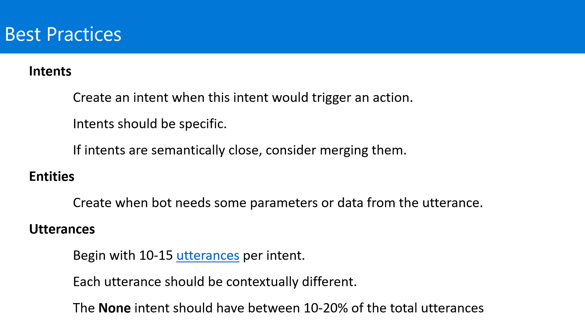

Consider the following best practices:

* Intents
	Create an intent when this intent would trigger an action. 
	Intents should be specific.
	If intents are semantically close, consider merging them.

* Entities
	Create when bot needs some parameters or data from the utterance.

* Utterances
	Begin with 10-15 utterances per intent.
	Each utterance should be contextually different.
	The None intent should have between 10-20% of the total utterances

### Section 4.2: Enterprise Considerations.

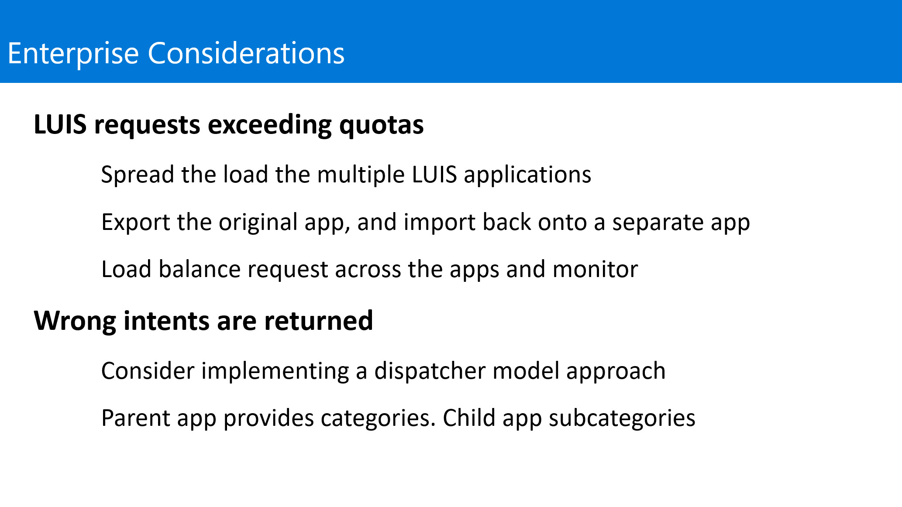

* LUIS app requests exceeding quotas.

If your LUIS app request rate exceeds the allowed quota rate, spread the load to more LUIS apps with the same app definition. Export the original LUIS app, then import the app back into separate apps. Each app has its own app ID. When you publish, instead of using the same key across all apps, create a separate key for each app. Balance the load across all apps so that no single app is overwhelmed. Add Application Insights to monitor usage. 

In order to get the same top intent between all the apps, make sure the intent prediction between the first and second intent is wide enough that LUIS is not confused, giving different results between apps for minor variations in utterances. 

Designate a single app as the master. Any utterances that are suggested for review should be added to the master app then moved back to all the other apps. This is either a full export of the app, or loading the labeled utterances from the master to the children. Loading can be done from either the LUIS website or the authoring API for a single utterance or for a batch. 
Schedule a periodic review of endpoint utterances for active learning, such as every two weeks, then retrain and republish. 

* Wrong intents are returned

if your app is meant to predict a wide variety of user utterances, consider implementing the dispatcher model. The parent app indicates top-level categories of questions. Create a child app for each subcategory. The child app breaks up the subcategory into relevant intents. Breaking up a monolithic app allows LUIS to focus detection between intents successfully instead of getting confused between intents across the top level and intents between the top level and sublevels. 
Schedule a periodic review of endpoint utterances for active learning, such as every two weeks, then retrain and republish. 

### Continue to [2_activity](./2_activity.md)
Back to [README](./0_README.md)