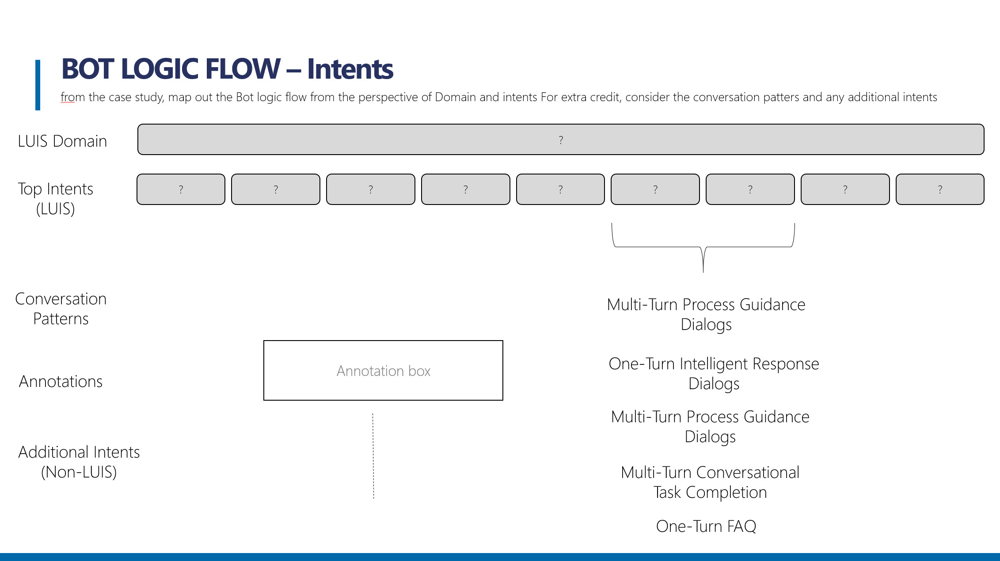
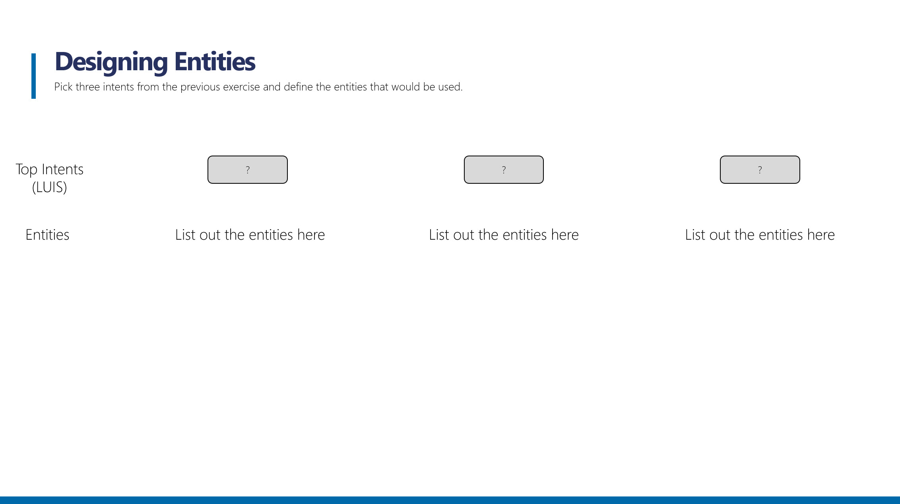
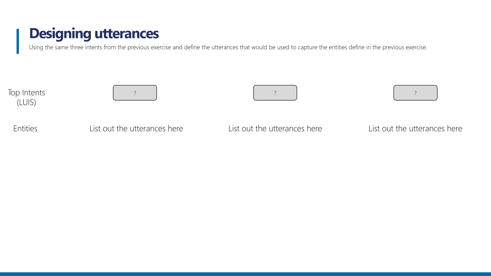

# 3.2: Activity - LUIS Design 

This design based lab will allow you to work in groups to explore the principles of LUIS Schema design. The output of the lab is for the class to create a set of artefacts that articulates the Intent design, Entity and Utterance design for a fictitious organization as defined in a case study.

## Objectives
In this lab, you will seperated into groups as directed by the instructor. Each group will be given an assignment to complete which will involve one of the following three objectives:

- Bot Flow Logic with Intents.
- Designing Entities.
- Managing Utterances.

## Case Study

A hotel chain CEO recently announced in a trade magazine that she is looking to enhance the customer experience by augmenting their in-person concierge service by embedding bot capabilities into their member services mobile app. The hotel guest reservations are held within an Azure SQL Database which contains the dates and the hotel location of the guest that is presented to the application. The bot is intended to handle the common request that guest will make such as setting up wake up calls, ordering services such as a pool cabana or spa session, or handling cab reservations with their in-house cab company. Therefore, the bot should be able to offer to book these services, providing a choice on dates and durations. The intention is to free up the real concierge’s time to focus on informing guest about the local area using local knowledge. It is critical that access to the bot is secured. The hotel chain is a Microsoft Shop. Their network is setup using AD, the databases using SQL Server and cloud applications developed in .Net in Azure. The CFO and CIO has made budget available for this project to be delivered within 6 months.

## Exercize 1: Bot Flow Logic with Intents

Using the graphic above, define the LUIS domains and intents that you can identify from the case study. As a challenge try to map the high level conversation patters to each of the intents that you identify.

## Exercize 2: Designing Entities 

Pick three intents from the previous exercise and define the entities that would be used. 

## Exercize 3: Designing Utterances

Using the same three intents from the previous exercise, define the utterances that would be used to capture the entities defined in the previous exercise. 

Back to [README](./0_README.md)