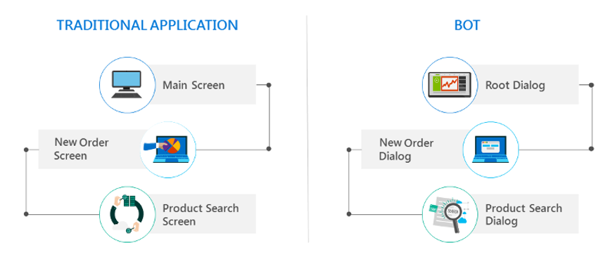
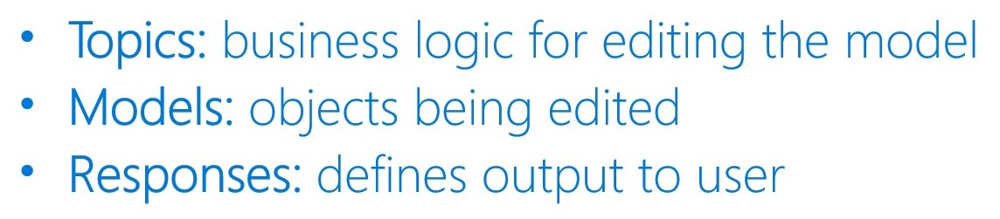
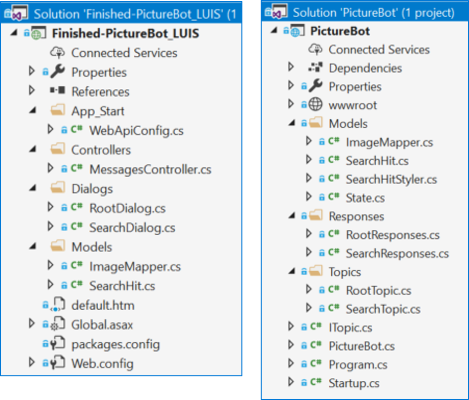

# 5.1: Integration with Cognitive Services (and more)

In this session, we will break up **making bots smarter** into three sections:
1.  Cognitive Services
2.  Adding Cognitive Services to bots
3.  Other ways to make bots smarter

## Section 1: Cognitive Services 
Cognitive Services can be used to infuse your apps, websites and [bots with algorithms](https://docs.microsoft.com/en-us/azure/bot-service/bot-service-concept-intelligence) to see, hear, speak, understand, and interpret your user needs through natural methods of communication. 

There are five main categories for the available Cognitive Services:
- **Language understanding**: Allow your apps to process natural language with pre-built scripts, evaluate sentiment and learn how to recognize what users want
- **Knowledge extraction**: Map complex information and data to solve tasks such as intelligent recommendations and semantic search
- **Speech recognition and conversion**: Convert spoken audio into text, use voice for verification, or add speaker recognition to your app
- **Web search**: Add Bing Search APIs to your apps and harness the ability to comb billions of webpages, images, videos, and news with a single API call
- **Image and video understanding**: Image-processing algorithms to identify, caption and moderate your pictures and videos  

There are also [Cognitive Services Labs](https://labs.cognitive.microsoft.com/), and we'll talk through what's on the horizon with them.


You can browse all the specific APIs in the [Services Directory](https://azure.microsoft.com/en-us/services/cognitive-services/directory/). 

Next, we're going to dive a bit deeper (but still relatively on the surface - check out the [documentation](https://docs.microsoft.com/en-us/azure/cognitive-services/Welcome) for technical details) - and provide something similar to a "cheat sheet" that includes a very brief each of the Cognitive Services. We'll tell you the main things they do and what to look out for (i.e. are they going away, only projects at the moment, etc.).

### Section 1.1: Language understanding
- [Language Understanding Intelligent Service (LUIS)](https://azure.microsoft.com/en-us/services/cognitive-services/language-understanding-intelligent-service/)
    - Extract intents and entities from natural language
- [Text Analytics API](https://azure.microsoft.com/en-us/services/cognitive-services/text-analytics/)
    - Determine language, key phrases, and sentiment
- [Bing Spell Check API](https://azure.microsoft.com/en-us/services/cognitive-services/spell-check/)
    - Correct spelling errors, recognize name differences, brands, slang, and homonyms
- [Translator Text API](https://azure.microsoft.com/en-us/services/cognitive-services/translator-text-api/)
    - Real-time text translation
- [Content Moderator](https://azure.microsoft.com/en-us/services/cognitive-services/content-moderator/)
    - Explicit or offensive content moderation for images and videos

### Section 1.2: Knowledge extraction
- [QnA Maker API](https://qnamaker.ai/)
    - Quickly and easily create simple question and answer bots based on FAQ URLs, structured documents, or editorial content

### Section 1.3: Speech recognition and conversion
- [Speech (preview)](https://azure.microsoft.com/en-us/services/cognitive-services/speech/)
    - Convert speech-to-text and text-to-speech, understand intent
        - [Speech to Text API](https://azure.microsoft.com/en-us/services/cognitive-services/speech-to-text/)
            - Convert audio to text, part of Speech services
        - [Text to Speech API](https://azure.microsoft.com/en-us/services/cognitive-services/text-to-speech/)
            - Convert text to speech, part of Speech services
        - [Speech Translation](https://azure.microsoft.com/en-us/services/cognitive-services/speech-translation/)
            - Easily add real-time speech translation to your bot
- [Speaker Recognition API (preview)](https://azure.microsoft.com/en-us/services/cognitive-services/speaker-recognition/)
    - Identify individual speakers or use speech as a means of authentication
- [Custom Speech Service (CRIS) (preview)](https://azure.microsoft.com/en-us/services/cognitive-services/custom-speech-service/)
    - Overcome speech recognition barriers such as speaking style, vocabulary, and background noise

### Section 1.4: Web search
- [Bing Web Search API](https://azure.microsoft.com/en-us/services/cognitive-services/bing-web-search-api/)
    - Conduct web searches within bots
- [Bing Image Search API](https://azure.microsoft.com/en-us/services/cognitive-services/bing-image-search-api/)
    - Conduct image searches within bots
- [Bing Video Search API](https://azure.microsoft.com/en-us/services/cognitive-services/bing-video-search-api/)
    - Conduct video searches within bots
- [Bing News Search API](https://azure.microsoft.com/en-us/services/cognitive-services/bing-news-search-api/)
    - Conduct news searches within bots
- [Bing Autosuggest API](https://azure.microsoft.com/en-us/services/cognitive-services/autosuggest/)
    - Automated search suggestions – _probably not applicable for a standard bot_
- [Bing Entity Search API](https://azure.microsoft.com/en-us/services/cognitive-services/bing-entity-search-api/)
    - Bring rich context about entities (like people, places, things, etc.)
- [Bing Custom Search API](https://azure.microsoft.com/en-us/services/cognitive-services/bing-custom-search/)
    - Easy-to-use, ad-free, commercial-grade search tool that lets you deliver the results you want
- [Bing Visual Search](https://azure.microsoft.com/en-us/services/cognitive-services/bing-visual-search/)
    - Enable users to search with images and gain insights in new ways

### Section 1.5: Image and video understanding
- [Computer Vision API](https://azure.microsoft.com/en-us/services/cognitive-services/computer-vision/)
    - Obtain tags, descriptions, adult/racy scores, text, hand writing, celebrities, and more from images
- [Face API](https://azure.microsoft.com/en-us/services/cognitive-services/face/)
    - Detect faces and compare similar ones, organize similar images in groups, identify previously tagged people in images
- [Video indexer (preview)](https://azure.microsoft.com/en-us/services/cognitive-services/video-indexer/)
    - Unlock video insights – _Video API ended, Video Indexer replaced it_
- [Custom Vision Service (preview)](https://azure.microsoft.com/en-us/services/cognitive-services/custom-vision-service/)
    - Custom image classification models made easy, also object detection is in preview
- [Content Moderator](https://azure.microsoft.com/en-us/services/cognitive-services/content-moderator/)  
    - Machine-assisted moderation of text and images

### Section 1.6: Cognitive Services Labs
- [Project Gesture](https://labs.cognitive.microsoft.com/en-us/project-gesture)
    - Incorporate gesture-based controls into your apps 
- [Project Local Insights](https://labs.cognitive.microsoft.com/en-us/project-local-insights)
    - Score the attractiveness of a location 
- [Project Event Tracking](https://labs.cognitive.microsoft.com/en-us/project-event-tracking)
    - Find events associated with Wikipedia entities 
- [Project Entity Linking](https://labs.cognitive.microsoft.com/en-us/project-entity-linking)
    - Disambiguates entities from context and links text from your bot to additional information 
- [Project Knowledge Exploration](https://labs.cognitive.microsoft.com/en-us/project-knowledge-exploration)
    - Quickly add interactive search to structured data 
- [Project Academic Knowledge](https://labs.cognitive.microsoft.com/en-us/project-academic-knowledge)
    - Help users find the academic resources they’re looking for
- [Project Ink Analysis](https://labs.cognitive.microsoft.com/en-us/project-ink-analysis)
    - Recognize digital handwriting and common shapes as well as layouts
- [Project Answer Search](https://labs.cognitive.microsoft.com/en-us/project-answer-search)
    - Instead of providing users with a list of ten blue links, the service sifts through millions of web documents and presents the relevant results
- [Project URL Preview](https://labs.cognitive.microsoft.com/en-us/project-url-preview)
    - Quickly provide a webpage preview of a URL's page title, description and relevant image
- [Project Conversation Learner](https://labs.cognitive.microsoft.com/en-us/project-conversation-learner)
    - Teach new behaviors to task-oriented conversational interfaces through example interactions
- [Project Personality Chat](https://labs.cognitive.microsoft.com/en-us/project-personality-chat)
    - Choose from multiple default personas to enhance chat conversations and easily add curated small talk responses
- [Project Anomaly Finder](https://labs.cognitive.microsoft.com/en-us/project-anomaly-finder)
    - Use ML to help understand abnormal events in data
- [Project Custom Decision](https://labs.cognitive.microsoft.com/en-us/project-custom-decision)
    - Use reinforcement learning in a new approach for personalizing content

## Section 2: Adding Cognitive Services to Bots

Let's assume you've completed all the recommended steps in the course up until now for a project you're working on. You've designed your bot, determined your LUIS schema, created an architecture, and picked Cognitive Services to include. Your next task is going to be to put it all together and actually build the bot.  

This is not a coding course, so we will not spend a lot of time here. We do want to share a few examples of how you _might_ integrate some of the various services into a bot. Our examples will show code from the .NET BotBuilder SDK ([v3](https://github.com/Microsoft/BotBuilder/tree/master/CSharp) and [v4](https://github.com/Microsoft/botbuilder-dotnet)).

The examples we will walk through will show how to integrate QnA Maker, LUIS, Azure Search, and Computer Vision.  

### Section 2.1: QnA Maker 

Integrating QnA Maker into a bot is simple with the v4 SDK. We'll highlight some of the code from [this sample](https://github.com/Microsoft/botbuilder-dotnet/tree/master/samples/Microsoft.Bot.Samples.Ai.QnA). If you'll be integrating this into a bot, it is quick, simple, and recommended to [build the SDK](https://github.com/Microsoft/botbuilder-dotnet/wiki/Building-the-SDK) and test out the sample yourself.  

The basic shell of your bot is [standard](https://marketplace.visualstudio.com/items?itemName=BotBuilder.botbuilderv4). To be able to access the QnA service, the first thing we'll want to do is update our Startup.cs file to configure the service. We can do this by updating `ConfigureServices` to the following:
```csharp
 public void ConfigureServices(IServiceCollection services)
        {
            services.AddBot<QnAMakerBot>(options =>
            {
                options.CredentialProvider = new 			
			ConfigurationCredentialProvider(Configuration);
                var qnaOptions = new QnAMakerMiddlewareOptions
                {
                    SubscriptionKey = "xxxxxx",
                    KnowledgeBaseId = "xxxxxx"
                };
                var middleware = options.Middleware;
                middleware.Add(new QnAMakerMiddleware(qnaOptions));
            });
        }
```
By updating, we've added the information related to our QnA Maker instance, and we've [added the middleware](https://docs.microsoft.com/en-us/azure/bot-service/bot-builder-create-middleware?view=azure-bot-service-4.0&tabs=csaddmiddleware%2Ccsetagoverwrite%2Ccsmiddlewareshortcircuit%2Ccsfallback%2Ccsactivityhandler) to call the service.

Finally, we create the main class for the bot we configured, called QnAMakerBot.cs. This example is very simple. We call the service with the user's request, and if there is a match, the service sends it to the user. If there is not a match or the user has just joined the conversation, you can see how we respond. Make sure you understand the code below: 

```csharp
using System.Threading.Tasks;
using Microsoft.Bot.Builder;
using Microsoft.Bot.Schema;

namespace Microsoft.Bot.Samples.Ai.QnA
    {
        public class QnAMakerBot : IBot
        {
            public QnAMakerBot() { }
            public async Task OnReceiveActivity(ITurnContext context)
            {
                switch (context.Activity.Type)
                {
                    case ActivityTypes.Message:
                        if (context.Activity.Type == ActivityTypes.Message && context.Responded == false)
                        {
                            await context.SendActivity("No good match found in the KB.");
                        }
                        break;
                    case ActivityTypes.ConversationUpdate:
                        foreach (var newMember in context.Activity.MembersAdded)
                        {
                            if (newMember.Id != context.Activity.Recipient.Id)
                            {
                                await context.SendActivity("Hello and welcome to the QnA Maker Sample bot.");
                            }
                        }
                        break;
                }
            }
        }
    }
```

You can also read more about [QnAMaker](https://www.qnamaker.ai/) and [how to use it with bots](https://docs.microsoft.com/en-us/azure/bot-service/bot-builder-howto-qna?view=azure-bot-service-4.0&tabs=cs).

### Section 2.2: LUIS 

Adding LUIS is similar to adding QnA Maker in the sense that we also use `ConfigureServices` to reference our service and add middleware to call it. In Startup.cs, we would update `ConfigureServices` to the following:

```csharp
 // This method gets called by the runtime. Use this method to add services to the container.
        public void ConfigureServices(IServiceCollection services)
        {
            services.AddSingleton(_ => Configuration);
            services.AddBot<PictureBot>(options =>
            {
                options.CredentialProvider = new ConfigurationCredentialProvider(Configuration);
                var middleware = options.Middleware;

                middleware.Add(new UserState<UserData>(new MemoryStorage()));
                middleware.Add(new ConversationState<ConversationData>(new MemoryStorage()));
                // Add Regex ability below
                middleware.Add(new RegExpRecognizerMiddleware()
                    .AddIntent("search", new Regex("search picture(?:s)*(.*)", RegexOptions.IgnoreCase))
                    .AddIntent("share", new Regex("share picture(?:s)", RegexOptions.IgnoreCase))
                    .AddIntent("order", new Regex("order picture(?:s)*(.*)", RegexOptions.IgnoreCase))
                    .AddIntent("help", new Regex("help(.*)", RegexOptions.IgnoreCase)));
                // Add LUIS ability below
                middleware.Add(new LuisRecognizerMiddleware(
                    new LuisModel(“AppId", “AppPassword", new Uri(“LuisUri"))));
            });
        }
```

You can see in this sample we are adding other middleware as well. We're using `UserState` and `ConversationState` to manage the context of our conversations.  

You might also notice we're adding `RegExRecognizerMiddleware` with intents of "search," "share," "order," and "help." For this example, we're creating a picture bot that can search, share, and order pictures. The reason we call RegEx first is to limit our calls to the LUIS service (optimizing cost and latency). For example, if a user says, "search pictures," we can take them to the case for that without calling LUIS. But, if the user says, "I'm looking to find a few pictures," we can call LUIS to determine what the user's intent is. We could even add a QnAMaker service below that, implemented in the same way as in section 2.1, to call QnAMaker if we don't get a response from LUIS.  

> Side Note: If you want to combine multiple LUIS apps and QnAMaker services, there's a [Dispatch tool](https://github.com/Microsoft/botbuilder-tools/tree/master/Dispatch) to help make that easier. You can read the [documentation here](https://docs.microsoft.com/en-us/azure/bot-service/bot-builder-tutorial-dispatch?view=azure-bot-service-4.0&tabs=csaddref%2Ccsbotconfig) and check out the [dispatch sample](https://github.com/Microsoft/botbuilder-dotnet/tree/master/samples-final/AspNetCore-Luis-Dispatch-Bot) if you're interested in learning more about it.

This example also involves organizing the code via [Topics](https://github.com/Microsoft/botbuilder-dotnet/blob/master/samples/AlarmBot/README.md). You don't need to understand Topics to understand the sample, but you can read more about them [here](https://github.com/Microsoft/botbuilder-dotnet/blob/master/samples/AlarmBot/README.md), and we'll mention them again in the next section.  

In our default topic, after we've confirmed we've greeted the user, we will handle their incoming messages as follows:

```csharp
public async Task<bool> ContinueTopic(ITurnContext context)
        {
            var conversation = ConversationState<ConversationData>.Get(context);
            var recognizedIntents = context.Services.Get<IRecognizedIntents>();

            switch (context.Activity.Type)
            {
                case ActivityTypes.Message:
                    switch (recognizedIntents.TopIntent?.Name)
                    {
                        case "search": //add search topic
                        case "share": //add share topic
                        case "order": //add order topic
                        case "help": //add help topic
                        default:
                            // adding app logic when Regex doesn't find an intent - consult LUIS
                            var result = 				context.Services.Get<RecognizerResult>(LuisRecognizerMiddleware.LuisRecognizerResultKey);
                            var topIntent = result?.GetTopScoringIntent();

                            switch ((topIntent != null) ? topIntent.Value.key : null)
                            {
                                case null: //add logic when there's no result
                                case "None": //add none logic
                                case "Help": //add help topic
                                case "OrderPic": //add order topic
                                case "SharePic": //add share topic
                                case "SearchPics": //add search topic
                                default: //add default action
                            }
                    }
            }
        }
```

Similar to Startup.cs, we are first checking if RegEx came back with any recognized intents. If it does, we branch off, but if it doesn't, we call LUIS and branch off accordingly.  

You can see the full lab for building this bot [here](https://github.com/Azure/LearnAI-Bootcamp/tree/master/lab02.2-building_bots) and the full bootcamp for Emerging AI Developers [here](https://github.com/Azure/LearnAI-Bootcamp/blob/master/emergingaidev_bootcamp.md). You can also read more about [middleware and the architecture for the v4 SDK](https://docs.microsoft.com/en-us/azure/bot-service/bot-builder-concept-activity-processing?view=azure-bot-service-4.0).

### Section 2.3: Azure Search

For Azure Search, we will continue with the previous example of developing a picture bot, focusing on how to add search to the bot.

Within the topic, you'll have to add three methods: `StartAsync`, `CreateSearchIndexClient`, and `SendResultsAsync`. 

In `StartAsync`, we'll call `CreateSearchIndexClient` to fill in our search service information, call the search service with the search request from our user, and call `SendResultsAsync` to create a response to send back to the user.

Review the sample code below:

```csharp
public async Task StartAsync(ITurnContext context)
        {
            ISearchIndexClient indexClientForQueries = CreateSearchIndexClient();
	     // Call the search service and store the results
            DocumentSearchResult results = await 			
		indexClientForQueries.Documents.SearchAsync(searchText);
            await SendResultsAsync(context, results);
        }
```

```csharp
 public ISearchIndexClient CreateSearchIndexClient()
        {
            string searchServiceName = “YourSearchService";
            string queryApiKey = “YourSearchKey";
            string indexName = “YourIndexName";
            SearchIndexClient indexClient = new SearchIndexClient(searchServiceName, indexName, new SearchCredentials(queryApiKey));
            return indexClient;
        }
```


```csharp
 public async Task SendResultsAsync(ITurnContext context, DocumentSearchResult results)
       {
            IMessageActivity activity = context.Activity.CreateReply();
            if (results.Results.Count == 0)
            {
                await SearchResponses.ReplyWithNoResults(context, searchText);
            }
            else // this means there was at least one hit for the search
            {
                // create the response with the result(s) and send to the user
                SearchHitStyler searchHitStyler = new SearchHitStyler();
                searchHitStyler.Apply(
                    ref activity,
                    "Here are the results that I found:",
                    results.Results.Select(r => 
				ImageMapper.ToSearchHit(r)).ToList().AsReadOnly());
                await context.SendActivity(activity);
            }
 ```

You can see the full lab for building this bot [here](https://github.com/Azure/LearnAI-Bootcamp/tree/master/lab02.2-building_bots) and the full bootcamp for Emerging AI Developers [here](https://github.com/Azure/LearnAI-Bootcamp/blob/master/emergingaidev_bootcamp.md). You can also find more Azure Search samples [here](https://github.com/Azure-Samples/search-dotnet-getting-started).

### Section 2.4: Computer Vision

The final sample we'll go through is good for those working with the BotBuilder v3 SDK for .NET. This [sample Computer Vision bot](https://github.com/Microsoft/BotBuilder-Samples/tree/master/CSharp/intelligence-ImageCaption) analyzes images and returns the caption to the user. We'll highlight a few pieces of the sample code.

In the web.config file, you'll need to add your endpoint and key as follows:

```html
 <appSettings>
    <add key = "MicrosoftVisionApiEndpoint" value="PUT-API-ENDPOINT-HERE" />
    <add key = "MicrosoftVisionApiKey" value="PUT-YOUR-OWN-API-KEY-HERE" />
 </appSettings>
```
You'll also need to create a class to store the results from your call to the Computer Vision API:
```csharp
namespace Microsoft.ProjectOxford.Vision.Contract
{
    public class AnalysisResult
    {
        public AnalysisResult();

        public Adult Adult { get; set; }
        public Category[] Categories { get; set; }
        public Color Color { get; set; }
        public Description Description { get; set; }
        public Face[] Faces { get; set; }
        public ImageType ImageType { get; set; }
        public Metadata Metadata { get; set; }
        public Guid RequestId { get; set; }
        public Tag[] Tags { get; set; }
    }
}
```

Once you have those two pieces configured, you can send the image(s) to the Computer Vision API and return the caption to the user:


```csharp
/// <summary>
/// This method calls <see cref="IVisionServiceClient.AnalyzeImageAsync(Stream, string[])"/> and
/// returns the first caption from the returned <see cref="AnalysisResult.Description"/>
/// </summary>
public async Task<string> GetCaptionAsync(Stream stream)
{
    var client = new VisionServiceClient(ApiKey);
    var result = await client.AnalyzeImageAsync(stream, VisualFeatures);
    return ProcessAnalysisResult(result);
}

private static string ProcessAnalysisResult(AnalysisResult result)
{
    string message = result?.Description?.Captions.FirstOrDefault()?.Text;

    return string.IsNullOrEmpty(message) ?
                "Couldn't find a caption for this one" :
                "I think it's " + message;
}
```

You can read more details about the Computer Vision bot, and even deploy it yourself, [here](https://github.com/Microsoft/BotBuilder-Samples/tree/master/CSharp/intelligence-ImageCaption).

## Section 3: Other ways to make bots smarter

In this section, we'll talk about some other ways to make bots smarter. The main topics we'll touch on are managing state data and organizing conversations.

### Section 3.1: Managing state data

The [Bot Builder Framework enables your bot to store and retrieve state data](https://docs.microsoft.com/en-us/azure/bot-service/bot-builder-storage-concept?view=azure-bot-service-4.0) that is associated with a user, a conversation, or a specific user within the context of a specific conversation. State data can be used for many purposes, such as determining where the prior conversation left off or simply greeting a returning user by name. If you store a user's preferences, you can use that information to customize the conversation the next time you chat. For example, you might alert the user to a news article about a topic that interests her or alert a user when an appointment becomes available.

In the Bot Builder v4 SDK, for each activity that your application receives, the adapter creates a [new turn context object](https://docs.microsoft.com/en-us/azure/bot-service/bot-builder-concept-activity-processing?view=azure-bot-service-4.0) that includes information about the channel, the sender, the conversation, and the received activity (you can see how the SDK does that [here](https://github.com/Microsoft/botbuilder-dotnet/tree/master/libraries/Microsoft.Bot.Builder.Core)). This context object exists only for the processing of that one activity (also referred to as one turn). Your bot is otherwise stateless. So, for testing and prototyping purposes, this may be enough. For production bots, you can implement your own storage adapter or use one of the Azure extensions. The Azure extensions allow you to store your bot's state data in either Table Storage, CosmosDB, or SQL.

If you're developing bots (with any SDK), read more about [Sage's success orchestrating multiple bots with multilingual support](https://www.microsoft.com/developerblog/2017/01/21/orchestrating-multiple-bots-with-multilingual-support/). To speak briefly, Sage was supporting its localization and channel needs by writing multiple copies of the same bot for every language and every channel. Each of these bots needed to be registered and maintained separately - which resulted in a lot of code to maintain. Microsoft and Sage partnered together to architect a single bot that used middleware to enable context switching, which means that the user can switch between different child bots (e.g. Credit Card Bot and Health Checkup Bot), and to enable development with a multilingual approach using language resources.  

Since then, Microsoft released a [tutorial for making your bot multilingual](https://docs.microsoft.com/en-us/azure/bot-service/bot-builder-howto-translation?view=azure-bot-service-4.0&tabs=cs) that guides you step-by-step for to make your bots multilingual like Sage's.  

**Is managing state a relatively new topic to you?** We have resources for you to learn more:  

* Get into the code behind [Bot State](https://github.com/Microsoft/botbuilder-dotnet/blob/master/libraries/Microsoft.Bot.Builder.Core.Extensions/BotState.cs) and using [Table Storage](https://github.com/Microsoft/botbuilder-dotnet/tree/master/libraries/Microsoft.Bot.Builder.Azure) in the v4 SDK
* Refer to the documentation for [saving state using conversation and user properties](https://docs.microsoft.com/en-us/azure/bot-service/bot-builder-howto-v4-state?view=azure-bot-service-4.0&tabs=csharp) and [writing state directly to storage](https://docs.microsoft.com/en-us/azure/bot-service/bot-builder-howto-v4-state?view=azure-bot-service-4.0&tabs=csharp)
* Go through the tutorials for [asking a user questions](https://docs.microsoft.com/en-us/azure/bot-service/bot-builder-tutorial-waterfall?view=azure-bot-service-4.0) and then [persisting the user data](https://docs.microsoft.com/en-us/azure/bot-service/bot-builder-tutorial-persist-user-inputs?view=azure-bot-service-4.0)
* If you're developing with the v3 SDK, read about the best practices from the Bot Framework Team regarding [saving state data with BotBuilder-Azure in .NET](https://blog.botframework.com/2017/07/18/Saving-State-Azure-Extensions/).

### Section 3.2: Dialogs vs Topics vs ?

There are many ways you can organize your code in bots. Ultimately, the decision will depend on the specifics of your project. When we were reviewing some of the aspects from the v4 SDK, a comment was made from the product group, "The SDK allows you to organize code in whatever way you want." The SDK puts you, the developer, in control by design.  

If you've developed or seen examples of v3 SDK bots, you'll notice that they're generally organized using Dialogs, where each Dialog, may represent the equivalent to a new screen in an application (see below and [read more](https://docs.microsoft.com/en-us/azure/bot-service/dotnet/bot-builder-dotnet-manage-conversation-flow)):




By the way, in case you were concerned about to implement your v3 Dialogs and FormFlow with the v4 SDK - [there’s a library for that](https://github.com/Microsoft/botbuilder-dotnet/tree/master/libraries/Microsoft.Bot.Builder.Classic) called "Microsoft.Bot.Builder.Classic", and there's also [some documentation on the process to convert to v4](https://docs.microsoft.com/en-us/azure/bot-service/bot-builder-howto-classic?view=azure-bot-service-4.0).

In the v4 SDK, specifically the [AlarmBot sample](https://github.com/Microsoft/botbuilder-dotnet/tree/master/samples/AlarmBot), we explore a [MVVM style](https://msdn.microsoft.com/en-us/library/hh848246.aspx) of organizing code around topics. You can [read more](https://github.com/Microsoft/botbuilder-dotnet/tree/master/samples/AlarmBot) about how they implement it with an AlarmBot, but a brief description is provided below:



To provide an example, take the picture bot we referenced when we talked about integrating services into bots. We created the bot with the v3 SDK with .NET Framework and the v4 SDK with .NET Core, and below shows how the organization differed:



So you can see, for this example, the result is similar. The nice part about using Topics with the v4 SDK is all responses are separated from the logic within the topics, making the topics relatively clean and focused on directing the conversation.  

At the end of the day, you should pick the organization that makes the most sense for your bot.

You can see the full set of labs for building the picture bot [here](https://github.com/Azure/LearnAI-Bootcamp/blob/master/emergingaidev_bootcamp.md).

#### Combining dialogs and topics

Interestingly enough, we recently announced a way for you to combine the principles behind dialogs and topics. We're calling it modular bot logic, where you would basically have organized conversations flows (i.e. Topics). The idea is that you could have a Dialog Container that handles multiple conversation flows, where each flow is separate and modular.  

One of the main issues with using Topics (preview section) is that sharing/cross referencing cannot be done easily. This is where the Dialog Container adds significant value. A Dialog Container can  take care of merging all the individual dialogs into one master dialog that makes cross referencing possible. You can read about the [implementation details here](https://docs.microsoft.com/en-us/azure/bot-service/bot-builder-compositcontrol?view=azure-bot-service-4.0).

### Continue to [2_activity](./2_activity.md)
Back to [README](./readme.md)  


